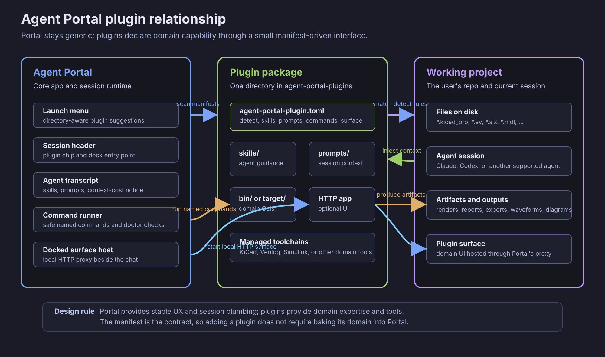

# Agent Portal Plugins

This repository is a collection of test and reference plugins for
[Agent Portal](https://github.com/meawoppl/agent-portal). Each plugin lives in a
subdirectory and contains its own `agent-portal-plugin.toml` manifest.



## Interface Design

Agent Portal owns the session lifecycle, agent launch, authentication, work
queues, docked surfaces, and plugin discovery UI. This repository owns
domain-specific plugin packages: manifests, skills, prompts, command shims,
managed toolchains, and optional HTTP workbench surfaces.

The interface is intentionally manifest-first:

- `[[detect]]` patterns let Portal suggest plugins for a working directory before
  an agent is launched.
- `[[skills]]` and `[[prompts]]` describe context Portal can inject into agent
  sessions, with visible context-cost accounting in the Portal UI.
- `[[commands]]` define safe, named command surfaces that Portal and agents can
  call without learning each plugin's private shell layout.
- `[surface]` describes an optional local HTTP app that Portal can start and dock
  beside the conversation.
- `[install]` and `[[toolchains]]` keep plugin setup and health checks inside
  the plugin package instead of hard-coding domain tooling into Portal.

This split keeps Agent Portal generic while still making plugin capability
discoverable in the launch menu, session header, plugin dock, and collapsed
plugin-context notice.

Install any plugin from its subdirectory:

```console
agent-portal plugin install github:meawoppl/agent-portal-plugins//kicadmium
agent-portal plugin install github:meawoppl/agent-portal-plugins//visilog
agent-portal plugin install github:meawoppl/agent-portal-plugins//unlinked
agent-portal plugin install github:meawoppl/agent-portal-plugins//yapcad
```

## Plugins

- [`visilog`](visilog/) - interactive design exploration with the native
  Visilog viewer: module hierarchy diagrams, live values, source inspection,
  stepping, breakpoints and JSON design graphs.
- [`unlinked`](unlinked/) - Simulink model review without MATLAB via
  [Unlinked](https://github.com/CosmicFrontierLabs/unlinked): SVG diagrams
  and subsystems, block inventories, the supported simulation subset with
  plotted traces, and MATLAB-to-Rust transpilation.
- [`yapcad`](yapcad/) - parametric [yapCAD](https://github.com/rdevaul/yapCAD)
  DSL workbench: retained builds with stats and previews, a live 3D/2D pane
  with sections, measurement and pinned annotations, STL/STEP/DXF/SVG
  exports, `.ycpkg` packages and assemblies.
- [`kicadmium`](kicadmium/) - all-Rust KiCad PCB/electronics workbench: one
  binary with a browser workbench, `kct` (a native port of kicad-tools) and
  `kct lint`. It replaces the former `kicad-pcb` plugin and lived in
  `meawoppl/kicadmium` (now archived) before moving here with its full history.
